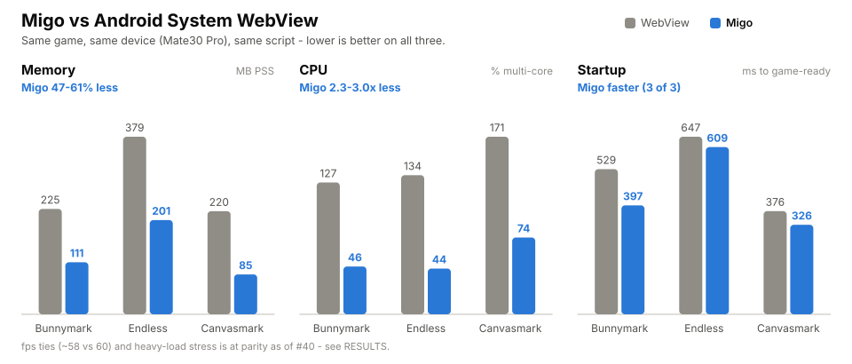

# migo-bench

[English](README.md) | [中文](README.zh-CN.md)

可复现的 **Migo vs Android 系统 WebView** 基准测试——同一游戏、同一设备、
同一交互脚本,在两种运行时上分别运行。这是 Migo「开源原生运行时,替代 WebView」定位背后的证据。

<picture>
  <source media="(prefers-color-scheme: dark)" srcset="assets/headline-dark.svg">
  
</picture>

<sub>Mate30 Pro · release 构建 · 3 款游戏(Pixi/WebGL、Phaser/WebGL、Canvas2D)· 每根柱子都可溯源到一个钉死的 Migo 版本。完整逐指标数据表 → **[RESULTS.md](RESULTS.md)**(中文)/ **[RESULTS.en.md](RESULTS.en.md)**。</sub>

> **状态 —— Migo 尚处 pre-1.0,持续迭代发布中。** 自 v0.9.0 起,每个版本都发布了可运行、带认证的 AAR —— 用 `--migo-aar release-tag:v0.9.3`(或 [minigame-labs/migo/releases](https://github.com/minigame-labs/migo/releases) 中任意 tag)即可自行复现每一个数字。本仓库就是这些数字背后公开、可审计的证据链。

> 本仓库兼具两个身份:**展示窗口**(采纳者/怀疑者都能自行重跑)与**回归测试框架**
> (每一次 Migo 的优化/修复,都用同一套对比重新跑一遍,对照基线)。
> 一个可信、可复现的基准测试*本身就是*营销物料 —— 可信度就是卖点。

## 📊 结果报告

**[RESULTS.md(中文,默认)](RESULTS.md)** · **[RESULTS.en.md (English)](RESULTS.en.md)** ——
设备 × 游戏矩阵 + 逐指标数据表(内存、启动、fps + 压力曲线、CPU、能耗)。
Mate30 Pro 上的结论摘要,**三款游戏结果高度一致**(bunnymark/Pixi、endless-runner/Phaser、canvasmark/Canvas2D),均已核对满屏渲染:**内存 Migo 少 47–61% · CPU 少 2.3–3.0× · 三款游戏首帧快 18–38%、可玩快 6–25% · fps 打平(两侧中位数都是 60,1% 低帧 59 vs 60)。** 其中 endless-runner 的可玩领先最薄,引用前先看 §1。
✅ **重载扩展性依然稳健** —— 压测到 22 万个精灵(远超任何真实小游戏的常规负载):两侧拐点都在 4 万,整条曲线逐档持平或 Migo 高 1 fps。本行早先版本还写过"Migo 运行更凉",2026-08-23 复现不出来,已撤回 —— 详见 RESULTS §4。

## 测什么(以及诚实的权重取舍)

- **头条指标 —— 一致性与可审计性 + 内存。** Migo 只打包一套运行时 → 所有设备行为一致;
  WebView 则随 OEM/系统/版本漂移。Migo 开源、可钉版本、可自行修复;WebView 是一个
  脱离你控制、异步更新的黑盒。内存占用有可测量的下降。
- **支撑指标 —— 效率。** 冷启动(游戏就绪)、PSS 内存、CPU、能耗、体积。
- **诚实披露 —— 吞吐量。** fps 通常打平;从不作为主打指标。fps 是 Migo 的*可控*
  项(可调,例如为省电封顶到 30),与能耗一并看。

### 测量数据来源(系统级、与 App 无关;已披露)

每个头条指标都从 Android 系统读取,而非 App 的自我上报。fps 采用**分层**数据源,
每行记录在 `fps_source` 字段中:

1. **`dumpsys SurfaceFlinger --latency`** 的画面呈现时间戳(真实显示帧率;对 Migo 的
   原生 SurfaceView 和 WebView 都适用)—— 自动探测对应图层。
2. **兜底方案**,用于受限 OEM(EMUI/华为返回全零):**两侧运行时都用游戏自身的
   埋点**(双方埋点一致 = 公平)。绝不会一侧用系统数据源、另一侧用 App 数据源混用。

冷启动 = `reportFullyDrawn()` + `am start -W`。内存 = `dumpsys meminfo`。

## 目录结构

```
games/       game payloads (bunnymark Pixi/WebGL, endless-runner Phaser/WebGL, canvasmark Canvas2D)
shells/      webview-shell + migo-shell  (symmetric minimal apps, each loads one game directly)
scripts/     lib.sh, capture-*.sh, run.sh, parse.py, compare.py, resolve-migo-aar.sh
baselines/   pinned reference result rows (regression gate compares new runs against these)
out/         results.csv + raw logs (gitignored except results.csv)
tests/       parse.py + compare.py fixture tests
.github/     host CI (pytest, script lint, webview-shell build, compare self-test)
```

## 测试纪律

**[MEASURING.md](MEASURING.md) —— 怎么在这里取数而不骗自己。** 十二个陷阱,每一个都已经
让这个仓库付出过代价:一个发布错的数字,或者白干一天。重新测量之前先读它。


- WebView 基线用的是**现代**壳(compileSdk 34)—— 绝不用老旧模板。
- 优先展示一致性/内存;诚实报告 fps(它是打平的)。
- 每一行结果都带**溯源信息**:migo 版本、设备、WebView 版本、harness
  版本、时间戳、`fps_source`。结果都绑定到确切的 Migo 版本(可审计性)。

## 复现操作手册

```bash
export PATH=$PATH:$ANDROID_HOME/platform-tools           # adb
python3 scripts/parse.py --header-only > out/results.csv
# WebView baseline:
bash scripts/run.sh --runtime webview --game bunnymark --device <SERIAL> --duration 60 --cold-runs 3
# Migo (pin a version: local dev AAR, a release tag, or a git sha):
bash scripts/run.sh --runtime migo --game bunnymark --device <SERIAL> --duration 60 --cold-runs 3 \
     --migo-aar local:$HOME/wkspace/migo/platforms/android/dist/migo-release.aar
column -t -s, out/results.csv
```

权威数据、设备 × 游戏矩阵,以及每一张逐指标数据表都在
**[RESULTS.md](RESULTS.md)**(中文)/ **[RESULTS.en.md](RESULTS.en.md)** —— 这里不重复。

### 压力场景 —— fps-vs-负载曲线(`--scenario stress`,仅 bunnymark)

```bash
bash scripts/run.sh --runtime migo    --game bunnymark --device <SERIAL> --scenario stress --duration 55 --migo-aar local:...
bash scripts/run.sh --runtime webview --game bunnymark --device <SERIAL> --scenario stress --duration 55
# -> out/stress_{migo,webview}.csv  (runtime,sprites,fps_median)
```

一条确定性的**游戏内精灵递增曲线**(2k→220k,每档 5 秒 —— 基于 Pixi ticker,两侧
完全一致;`scripts/make-stress-game.sh` 由常规版本生成)驱动负载增长,harness 同时
记录 `bunnies=N fps=M`。fps 相对 N 作图。两条曲线在整个爬升过程中相互跟随
(Migo 打平,高载端略胜)—— 详见 RESULTS §4。
`scripts/stress-ab.sh` 在冷启动闸门下运行该场景,并记录每个 CPU 集群的频率。

## 回归测试工作流 —— 对照基线做比较

这套框架的核心用途:**未来任何 Migo 的修复/优化,都用同一套采集流程重新跑一遍,
并与钉死的基线做 diff。** `scripts/compare.py` 把两份 `results.csv` 转成一个结论。

```bash
# 1) Showcase table — Migo vs WebView for a game (from one results.csv):
python3 scripts/compare.py --results out/results.csv --game bunnymark --vs-webview

# 2) Regression gate — a NEW Migo build vs the committed baseline (same game).
#    Exits non-zero if any metric regressed past --threshold (default 5%) -> gate a PR.
python3 scripts/compare.py --results out/results.csv --baseline baselines/mate30.csv --game bunnymark
```

各指标都带方向性(内存/CPU/启动越低越好,fps 越高越好);在阈值范围内的变化
视为单次运行的噪声。基线文件提交在 `baselines/` 下,并标注了采集时对应的 Migo
版本。`.github/workflows/ci.yml` 在每次 push 时运行主机侧检查(pytest、脚本 lint、
WebView 壳构建,以及一个 compare 自检)——真机采集仍在本地完成(托管 runner 没有手机)。

## Migo 版本钉定

harness 接受 `--migo-aar <release-tag | local:PATH | sha>`,因此一个进行中的修复
可以对照本地开发版 AAR 跑基准,已发布的数字则钉死某个 release tag。每条结果都会
标注实际解析出的版本号。

## 联系方式

- 商业授权:licensing@minigame-labs.com
- 安全问题:见 [SECURITY.zh-CN.md](SECURITY.zh-CN.md)
